# azure-infra-cli

[](https://github.com/alderichoarau/azure-infra-cli/actions/workflows/ci.yml) [](https://github.com/alderichoarau/azure-infra-cli/actions/workflows/dependabot/dependabot-updates)

> Provisioning Azure infrastructure with az CLI — Bash and PowerShell scripts with GitHub Actions automation

---

## Architecture

```mermaid
graph TD
    subgraph rg-shared-prf2026
        PLAN[App Service Plan<br/>plan-npr-prf2026<br/>B1 Linux]
    end

    subgraph rg-firstname-lastname
        SA[Storage Account<br/>st&#123;owner&#125;cli]
        APP[App Service<br/>app-&#123;owner&#125;-cli<br/>Python 3.11]
        FN[Function App<br/>fn-&#123;owner&#125;-cli<br/>Python 3.11]
        SAFN[Storage Account<br/>stfn&#123;owner&#125;<br/>purpose=function-storage]
        STAPP[Static Web App<br/>stapp-&#123;owner&#125;-cli<br/>westeurope]
        ACI[Container ACI<br/>aci-&#123;owner&#125;-cli<br/>nginx]
    end

    PLAN --> APP
    PLAN --> FN
    SAFN --> FN

    style PLAN fill:#f0f0f0
    style SA fill:#e8f4fd
    style APP fill:#e8f4fd
    style FN fill:#e8f4fd
    style SAFN fill:#e8f4fd
    style STAPP fill:#e8f4fd
    style ACI fill:#e8f4fd
```



All resources are tagged `managed_by=cli` — automatically deleted every Friday at 18:00 UTC without touching the Resource Group or Terraform resources.

---

## Provisioned Resources

| Resource | Name | Description |
|----------|------|-------------|
| Storage Account | `st{owner}cli` | General-purpose object storage |
| App Service Plan | `plan-npr-prf2026` | Shared compute capacity (B1 Linux) — in `rg-shared-prf2026` |
| App Service | `app-{owner}-cli` | Python 3.11 Web App |
| Function App | `fn-{owner}-cli` | Python 3.11 Function App |
| Static Web App | `stapp-{owner}-cli` | Static site hosting |
| Container (ACI) | `aci-{owner}-cli` | Publicly accessible nginx container |

---

## Structure

```
azure-infra-cli/
├── bash/
│   ├── provision.sh     # creates all resources with tags
│   └── destroy.sh       # deletes only resources tagged managed_by=cli
├── powershell/
│   ├── provision.ps1    # PowerShell equivalent of provision.sh
│   └── destroy.ps1      # PowerShell equivalent of destroy.sh
└── .github/
    └── workflows/
        ├── provision.yml  # manual trigger from GitHub Actions
        ├── cleanup.yml    # automatic every Friday at 18:00 UTC
        └── ci.yml         # ShellCheck, actionlint, PSScriptAnalyzer
```

---

## Setup

### 1. GitHub Secrets to configure

In **Settings → Secrets and variables → Actions**:

| Secret | Description |
|--------|-------------|
| `AZURE_CLIENT_ID` | Service principal ID (OIDC) |
| `AZURE_TENANT_ID` | Azure AD tenant ID |
| `AZURE_SUBSCRIPTION_ID` | Subscription ID |
| `AZURE_RESOURCE_GROUP` | Your resource group name (`rg-firstname-lastname`) |

### 2. Provision resources

**Via GitHub Actions (recommended):**

Go to **Actions → Provision Azure Resources → Run workflow** → enter your resource group name and choose a shell.

**Locally (bash):**
```bash
export OWNER="firstname-lastname"
export RESOURCE_GROUP="rg-firstname-lastname"
az login
bash bash/provision.sh
```

**Locally (PowerShell):**
```powershell
$env:OWNER = "firstname-lastname"
$env:RESOURCE_GROUP = "rg-firstname-lastname"
az login
pwsh powershell/provision.ps1
```

### 3. Destroy resources

**Automatic:** every Friday at 18:00 UTC (20:00 Paris), the `cleanup.yml` workflow deletes all `managed_by=cli` resources.

**Manual via GitHub Actions:**

Go to **Actions → Friday Evening Cleanup → Run workflow**

**Locally (bash):**
```bash
export OWNER="firstname-lastname"
export RESOURCE_GROUP="rg-firstname-lastname"
bash bash/destroy.sh
```

---

## Tags and coexistence with Terraform

| Tag | Managed by | Deleted by cleanup.yml |
|-----|-----------|------------------------|
| `managed_by=cli` | `provision.sh` / `provision.ps1` | yes |
| `managed_by=terraform` | Terraform | never |

Terraform resources in the same Resource Group are never touched by this script.

---

## Troubleshooting

### Docker Hub rate limit — Container ACI creation fails

```text
RegistryErrorResponse: An error response is received from the docker registry 'index.docker.io'
```

Docker Hub throttles anonymous pulls. Wait a few minutes and re-run the workflow, or trigger only the ACI step manually.

---

### Storage account name too long

```text
AccountNameInvalid: is not a valid storage account name (max 24 chars)
```

Azure storage account names are limited to 24 lowercase alphanumeric characters. The `{owner}` value (with hyphens removed) must be short enough. Shorten your `firstname-lastname`.

---

### Static Web App region not available

```text
LocationNotAvailableForResourceType: 'francecentral' is not available for 'Microsoft.Web/staticSites'
```

Static Web Apps are not available in `francecentral`. The script uses `westeurope` as a fallback — this is expected behavior.

---

### Resource Group not found

```text
ResourceGroupNotFound: Resource group 'rg-...' could not be found
```

The resource group must be pre-created by the trainer before running the provisioning workflow.

---

### App Service Plan not found

```text
ResourceNotFound: The Resource 'Microsoft.Web/serverFarms/plan-npr-prf2026' was not found
```

The shared App Service Plan lives in `rg-shared-prf2026`, not in your resource group. Verify that `rg-shared-prf2026` exists and contains `plan-npr-prf2026`.

---

Azure DevSecOps Training — Simplon
